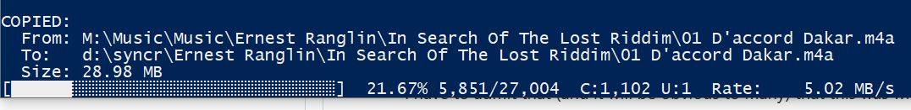

# m3u-filetransfer

Initially built to transfer an iTunes exported .m3u tracklist to a SD card or other device. 
It will create, or update, files in the target folder. A display of percentage progress and a count/total. C=created, U-updated. A rudimentary data transfer rate is displayed. . 

WARNING: It will delete files no longer in the playlist (you have the option to cancel this).
A verbose mode, that displays the currently written file can be enabled by adding '--verbose' to the command line.
A time offset mode (as yet not fully tested) allows for any small fixed discrepancy due to the way that various OSes handle daylight saving times.

Syntax: _python m3u_transfer_v1.0.0.py <playlist name> <iTunes path> <destination folder> (--verbose --time_offset <hours>)_.

Windows example: _python m3u_transfer_v1.0.0.py "a playlist.m3u" "C:\iTunes\Music\" "D:\music\"_
  (this effectively strips the iTunes folder info from the host device's path for tidiness and replaces it with the target).
  
Linux example:  _python m3u_transfer_v1.0.0.py "a playlist.m3u" "/run/media/me/HDDBackup/C/iTunes/Music/" "/run/media/me/512GBSD/music"_
  (an example based on the transfer between a mounted external HDD and the target SD card, also mounted).

Offset:
for a one-hour positive offset: _python m3u_transfer_v1.0.0.py "a playlist.m3u" "C:\iTunes\Music\" "D:\music\" --offset 1_
for one hour backwards: _python m3u_transfer_v1.0.0.py "a playlist.m3u" "C:\iTunes\Music\" "D:\music\" --offset -1_

For half hours you can use fractions ie, 30 minutes: --offset 0.5 or 90 minutes: --offset 1.5
Another point to note: 
If you have:
Source:       12:00
Destination:  12:30

if you set --offset 1, the comparison effectively becomes:
Source:       13:00
Destination:  12:30

so the file will be updated. But without an offset, the source would be considered older and left alone.

I have to admit that (and it will be obvious to many) that this was written with the assistance of ChatGPT, hence the MIT licence as I cannot really say that I wrote it myself. I can program, and have been doing so for 40 years, but I needed a quick solution when I discovered that the App/program I'd paid for stopped working. 
Sorry, I've not written documentation for years! and this is my first proper attempt at uploading/publishing to GitHub.

Use at your own risk.
